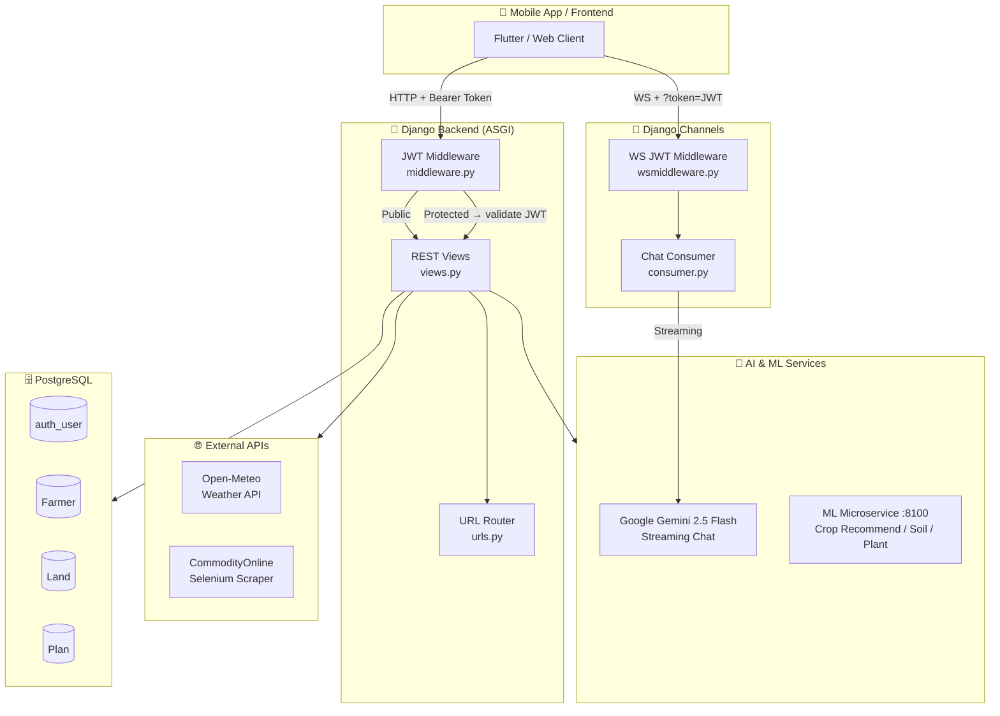
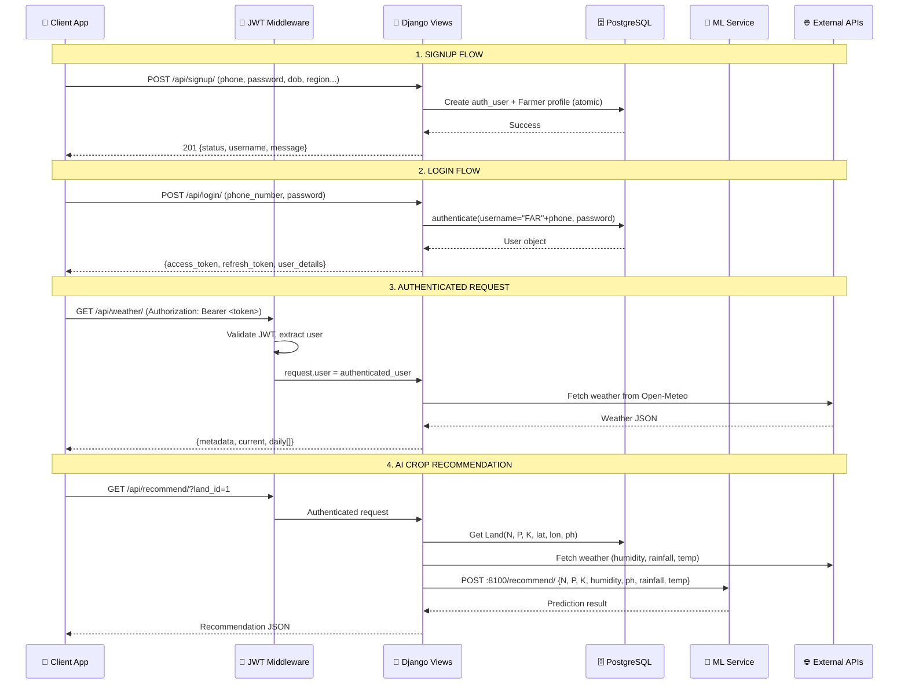
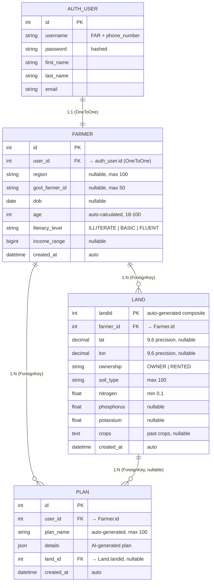
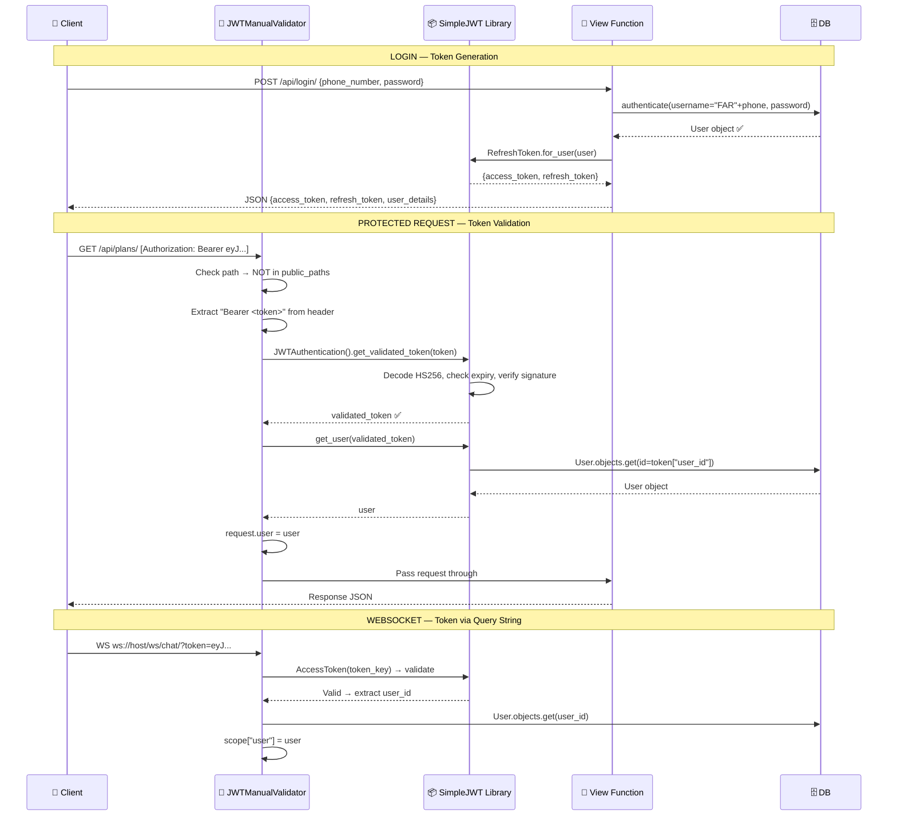
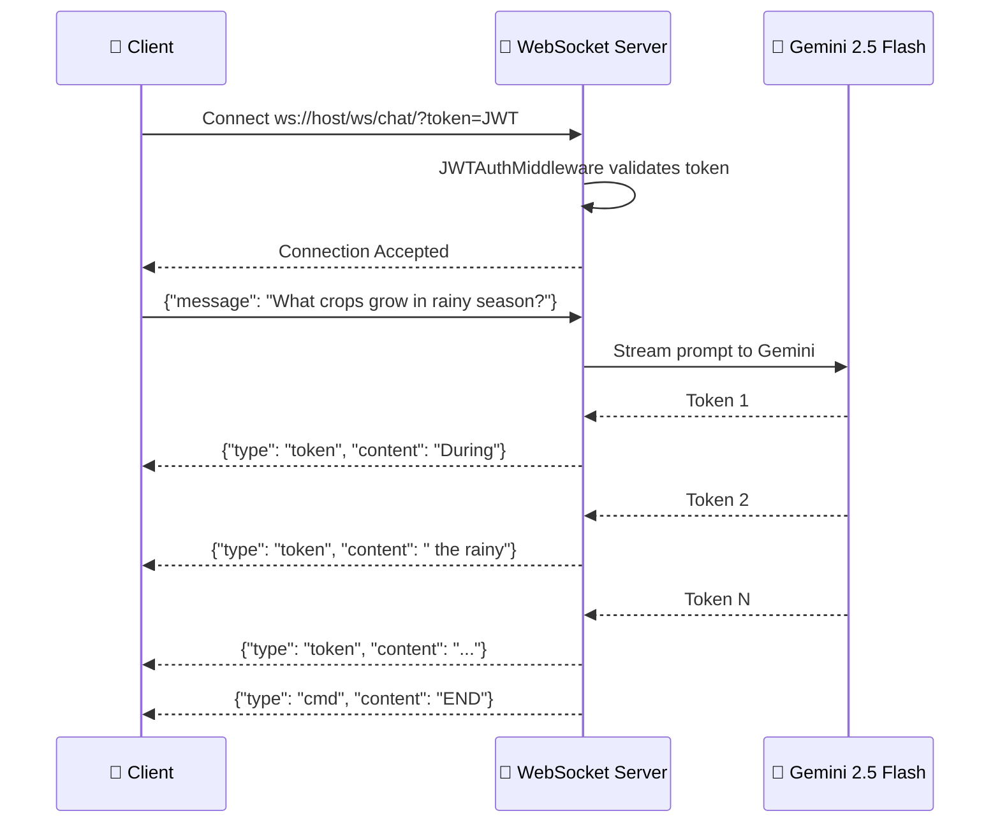

# 🌾 KhetiMitra Backend — API Documentation & System Design

> **KhetiMitra** is an AI-powered agricultural assistant backend built with **Django 5.1**, **Django Channels**, **PostgreSQL**, and **Google Gemini AI**. It serves Indian farmers with crop recommendations, weather data, market prices, plant diagnostics, and a real-time AI chat.

---

## Table of Contents

- [Architecture Overview](#-architecture-overview)
- [System Flow Diagram](#-system-flow-diagram)
- [Tech Stack](#-tech-stack)
- [Database Schema](#-database-schema)
- [JWT Authentication](#-jwt-authentication--flow)
- [API Reference](#-api-reference)
- [WebSocket API](#-websocket-api)
- [Error Codes](#-error-codes)

---

## 🏗 Architecture Overview



### Layered Architecture

| Layer | Component | File |
|---|---|---|
| **Entry Point** | ASGI Application | `khetimitra/asgi.py` |
| **Routing** | HTTP URL Router | `services/urls.py` |
| | WebSocket Router | `services/routing.py` |
| **Middleware** | HTTP JWT Validator | `services/middleware.py` |
| | WebSocket JWT Auth | `services/wsmiddleware.py` |
| **Views** | REST API Handlers | `services/views.py` |
| **Consumers** | WebSocket Chat | `services/consumer.py` |
| **Models** | ORM / DB Schema | `services/models.py` |
| **Utilities** | Weather, AI, Plans | `services/utilities.py` |
| **Price Scraper** | Selenium Mandi Prices | `services/price_api.py` |
| **AI Chat** | Gemini Streaming | `services/chatmodel.py` |
| **Config** | Django Settings | `khetimitra/settings.py` |

---

## 🔄 System Flow Diagram



---

## 🛠 Tech Stack

| Category | Technology |
|---|---|
| **Framework** | Django 5.1 + Django REST Framework |
| **Async / WebSocket** | Django Channels (InMemoryChannelLayer) |
| **Database** | PostgreSQL 16 |
| **Auth** | `djangorestframework-simplejwt` (HS256) |
| **AI** | Google Gemini 2.5 Flash (streaming) |
| **Weather** | Open-Meteo API (cached with `requests-cache`) |
| **Market Data** | Selenium headless Chrome scraper |
| **ML Service** | External microservice at `localhost:8100` |
| **Server** | ASGI (Daphne / Uvicorn) |

---

## 🗄 Database Schema

### Entity Relationship Diagram



### Table Details

#### `auth_user` (Django Built-in)

Django's default `User` model. The `username` field stores `"FAR" + phone_number` as a unique identifier.

| Column | Type | Constraints |
|---|---|---|
| `id` | `int` | PK, auto-increment |
| `username` | `varchar(150)` | Unique — stores `FAR{phone}` |
| `password` | `varchar(128)` | Hashed (PBKDF2) |
| `first_name` | `varchar(150)` | |
| `last_name` | `varchar(150)` | |
| `email` | `varchar(254)` | |

#### `services_farmer`

| Column | Type | Constraints | Notes |
|---|---|---|---|
| `id` | `bigint` | PK, auto | |
| `user_id` | `int` | FK → `auth_user.id`, Unique | OneToOne link |
| `region` | `varchar(100)` | Nullable | e.g. "Maharashtra" |
| `govt_farmer_id` | `varchar(50)` | Nullable | Government ID |
| `dob` | `date` | Nullable | Date of birth |
| `age` | `int` | 18 ≤ x ≤ 100 | Auto-calculated from `dob` on save |
| `literacy_level` | `varchar(15)` | Required | `ILLITERATE`, `BASIC`, `FLUENT` |
| `income_range` | `bigint` | Nullable | Annual income |
| `created_at` | `timestamptz` | Auto | |

#### `services_land`

| Column | Type | Constraints | Notes |
|---|---|---|---|
| `landid` | `int` | PK | Auto-generated: `{farmer_name}LAND{uuid8}{timestamp}` |
| `farmer_id` | `int` | FK → `services_farmer.id` | Cascade delete |
| `lat` | `decimal(9,6)` | Nullable | GPS latitude |
| `lon` | `decimal(9,6)` | Nullable | GPS longitude |
| `ownership` | `varchar(10)` | Required | `OWNER` or `RENTED` |
| `soil_type` | `varchar(100)` | Required | From image analysis |
| `nitrogen` | `float` | Min 0.1 | From image analysis |
| `phosphorus` | `float` | Nullable | From image analysis |
| `potassium` | `float` | Nullable | From image analysis |
| `crops` | `text` | Nullable | Past/eligible crops |
| `created_at` | `timestamptz` | Auto | |

#### `services_plan`

| Column | Type | Constraints | Notes |
|---|---|---|---|
| `id` | `bigint` | PK, auto | |
| `user_id` | `int` | FK → `services_farmer.id` | Cascade delete |
| `plan_name` | `varchar(100)` | Auto-generated | `{farmer_name}PLAN{uuid8}{timestamp}` |
| `details` | `jsonb` | Required | AI-generated farming plan |
| `land_id` | `int` | FK → `services_land.landid`, Nullable | Associated land |
| `created_at` | `timestamptz` | Auto | |

---

## 🔐 JWT Authentication — Flow

### Configuration (`settings.py`)

```python
SIMPLE_JWT = {
    'ACCESS_TOKEN_LIFETIME': timedelta(days=1),    # 24 hours
    'REFRESH_TOKEN_LIFETIME': timedelta(days=7),   # 7 days
    'ROTATE_REFRESH_TOKENS': False,
    'ALGORITHM': 'HS256',
    'SIGNING_KEY': SECRET_KEY,
    'AUTH_HEADER_TYPES': ('Bearer',),
}
```

### How JWT Works in This System



### JWT Token Structure (HS256)

```
Header:   { "alg": "HS256", "typ": "JWT" }
Payload:  { "token_type": "access", "exp": 1707696000, "iat": 1707609600, "jti": "abc123...", "user_id": 5 }
Signature: HMACSHA256(base64(header) + "." + base64(payload), SECRET_KEY)
```

### Auth Required Matrix

| Endpoint | Method | Auth Required | Middleware |
|---|---|---|---|
| `POST /api/signup/` | POST | ❌ Public | — |
| `POST /api/login/` | POST | ❌ Public | — |
| `GET /api/weather/` | GET | ✅ Bearer Token | `JWTManualValidator` |
| `GET /api/market/` | GET | ✅ Bearer Token | `JWTManualValidator` |
| `GET /api/plans/` | GET | ✅ Bearer Token | `JWTManualValidator` |
| `POST /api/plans/add/` | POST | ✅ Bearer Token | `JWTManualValidator` |
| `GET /api/recommend/` | GET | ✅ Bearer Token | `JWTManualValidator` |
| `POST /api/diagnosis/` | POST | ✅ Bearer Token | `JWTManualValidator` |
| `GET /api/lands/` | GET | ✅ Bearer Token | `JWTManualValidator` |
| `POST /api/lands/add/` | POST | ✅ Bearer Token | `JWTManualValidator` |
| `WS /ws/chat/` | WebSocket | ✅ Query Param `?token=` | `JWTAuthMiddleware` |

### Middleware Pipeline

```
Request → JWTManualValidator → SecurityMiddleware → SessionMiddleware → CommonMiddleware
        → CsrfViewMiddleware → AuthenticationMiddleware → MessageMiddleware
        → XFrameOptionsMiddleware → View
```

> **Key:** `JWTManualValidator` runs **first** in the middleware stack. It intercepts all `/api/*` requests (except `/api/signup/` and `/api/login/`) and validates the JWT token *before* any Django middleware runs.

---

## 📡 API Reference

### Base URL

```
HTTP:      http://localhost:8000/
WebSocket: ws://localhost:8000/ws/chat/
```

---

### 1. `POST /api/signup/` — Register New Farmer

**Auth:** ❌ None

**Content-Type:** `application/x-www-form-urlencoded`

| Field | Type | Required | Description |
|---|---|---|---|
| `phone_number` | `string` | ✅ | eg. `9876543210` |
| `password` | `string` | ✅ | Min 8 chars (Django validators) |
| `first_name` | `string` | ❌ | |
| `last_name` | `string` | ❌ | |
| `email` | `string` | ❌ | |
| `region` | `string` | ❌ | e.g. `"Maharashtra"` |
| `govt_farmer_id` | `string` | ❌ | |
| `dob` | `string` | ✅ | Format: `YYYY-MM-DD` |
| `literacy_level` | `string` | ❌ | `ILLITERATE`, `BASIC` (default), `FLUENT` |
| `income_range` | `integer` | ❌ | Annual income |

**Success Response** `201 Created`
```json
{
    "status": "success",
    "username": "FAR9876543210",
    "message": "User and Profile created successfully"
}
```

**Error Response** `400 Bad Request`
```json
{ "error": "UNIQUE constraint failed: auth_user.username", "type": "inbound" }
```

---

### 2. `POST /api/login/` — Authenticate & Get JWT

**Auth:** ❌ None

**Content-Type:** `application/x-www-form-urlencoded`

| Field | Type | Required | Description |
|---|---|---|---|
| `phone_number` | `string` | ✅ | The raw phone number |
| `password` | `string` | ✅ | |

**Success Response** `200 OK`
```json
{
    "access_token": "eyJhbGciOiJIUzI1NiIs...",
    "refresh_token": "eyJhbGciOiJIUzI1NiIs...",
    "user_details": {
        "first_name": "Ravi",
        "last_name": "Kumar",
        "phone": "9876543210"
    }
}
```

**Error Response** `401 Unauthorized`
```json
{ "error": "Invalid phone or password" }
```

---

### 3. `GET /api/weather/` — Weather Forecast

**Auth:** ✅ `Authorization: Bearer <access_token>`

| Param | Type | Required | Default | Description |
|---|---|---|---|---|
| `lat` | `float` | ❌ | `20` | Latitude |
| `lon` | `float` | ❌ | `10` | Longitude |

**Success Response** `200 OK`
```json
{
    "metadata": {
        "lat": 19.0,
        "lon": 72.8,
        "elevation": 14.0,
        "timezone": "Asia/Kolkata"
    },
    "current": {
        "time": 1707609600,
        "temp": 28.5,
        "humidity": 65.0,
        "precipitation": 0.0,
        "is_day": true,
        "feels_like": 30.2
    },
    "daily": [
        {
            "date": "2026-02-10",
            "weather_code": 1,
            "temp_max": 32.5,
            "temp_min": 22.1,
            "rain_sum_mm": 0.0,
            "precip_prob": 10.0
        }
    ]
}
```

**Source:** [Open-Meteo API](https://api.open-meteo.com) — 16-day forecast, cached for 1 hour.

---

### 4. `GET /api/market/` — Mandi Commodity Prices

**Auth:** ✅ `Authorization: Bearer <access_token>`

| Param | Type | Required | Default | Description |
|---|---|---|---|---|
| `state` | `string` | ❌ | `"Mumbai"` | State name |
| `mandi` | `string` | ❌ | `"ok"` | Mandi name |
| `crop` | `string` | ❌ | `"wheat"` | Crop name |

**Success Response** `200 OK`
```json
{
    "meta": {
        "Commodity": "Wheat",
        "State": "Maharashtra",
        "District": "Ahmednagar"
    },
    "prices": {
        "27/12/2025": 2650.0,
        "26/12/2025": 2600.0,
        "25/12/2025": 2680.0
    }
}
```

**Source:** Selenium headless scraper on [CommodityOnline](https://www.commodityonline.com/mandiprices/).

---

### 5. `GET /api/plans/` — Get All Plans for User

**Auth:** ✅ `Authorization: Bearer <access_token>`

| Param | Type | Required | Description |
|---|---|---|---|
| `id` | `int` | ❌ | Optional — get a specific plan by ID |

**Success Response (all)** `200 OK`
```json
[
    {
        "id": 1,
        "user_id": 3,
        "plan_name": "RaviPLAN12345671707609600",
        "details": { "...AI-generated plan..." },
        "land_id": 1,
        "created_at": "2026-02-10T07:30:00Z"
    }
]
```

**Success Response (single `?id=1`)** `200 OK`
```json
{
    "id": 1,
    "user_id": 3,
    "plan_name": "RaviPLAN12345671707609600",
    "details": { "crop": "rice", "schedule": [...] },
    "land_id": 1,
    "created_at": "2026-02-10T07:30:00Z"
}
```

---

### 6. `POST /api/plans/add/` — Create AI-Generated Plan

**Auth:** ✅ `Authorization: Bearer <access_token>`

**Content-Type:** `application/json`

```json
{
    "crop": "rice",
    "land_id": 1
}
```

**Success Response** `200 OK`
```json
{
    "message": "Plan added",
    "id": 5,
    "plan": { "...AI-generated farming plan..." }
}
```

---

### 7. `GET /api/recommend/` — AI Crop Recommendation

**Auth:** ✅ `Authorization: Bearer <access_token>`

| Param | Type | Required | Description |
|---|---|---|---|
| `land_id` | `int` | ❌ | Land ID (default: `80`) |

**How it works:**
1. Fetches Land data (N, P, K, lat, lon, ph) from DB
2. Fetches live weather (humidity, rainfall, temperature)
3. Sends all to ML service at `localhost:8100/recommend/`
4. Returns prediction

**Success Response** `200 OK`
```json
{
    "recommended_crop": "rice",
    "confidence": 0.92,
    "alternatives": ["wheat", "maize"]
}
```

---

### 8. `POST /api/diagnosis/` — Plant Disease Diagnosis

**Auth:** ✅ `Authorization: Bearer <access_token>`

**Content-Type:** `multipart/form-data`

| Field | Type | Required | Description |
|---|---|---|---|
| `image` | `file` | ✅ | Photo of plant leaf/stem |

**How it works:**
1. Saves uploaded image to `media/lands/`
2. Sends image path to ML service at `localhost:8100/plant/`
3. Passes ML result to **Google Gemini** for a detailed AI report
4. Returns diagnosis

**Success Response** `200 OK`
```json
{
    "diagnosis": "The plant appears to have bacterial leaf blight. Recommended treatment: ..."
}
```

**Error Response** `400 Bad Request`
```json
{ "error": "No image" }
```

---

### 9. `GET /api/lands/` — Get All Lands for User

**Auth:** ✅ `Authorization: Bearer <access_token>`

**Success Response** `200 OK`
```json
[
    {
        "landid": 123456,
        "farmer_id": 3,
        "lat": "19.076090",
        "lon": "72.877426",
        "ownership": "OWNER",
        "soil_type": "Red Loamy",
        "nitrogen": 45.2,
        "phosphorus": 12.5,
        "potassium": 30.0,
        "crops": "rice, wheat",
        "created_at": "2026-01-15T10:30:00Z"
    }
]
```

---

### 10. `POST /api/lands/add/` — Register New Land (with Soil Image Analysis)

**Auth:** ✅ `Authorization: Bearer <access_token>`

**Content-Type:** `multipart/form-data`

| Field | Type | Required | Description |
|---|---|---|---|
| `image` | `file` | ✅ | Soil photograph |
| `lat` | `decimal` | ❌ | GPS latitude |
| `lon` | `decimal` | ❌ | GPS longitude |
| `ownership` | `string` | ❌ | `OWNER` (default) or `RENTED` |

**How it works:**
1. Saves uploaded soil image to `media/lands/`
2. Sends to ML service `localhost:8100/soil/` for analysis
3. Creates `Land` record with extracted: `soil_type`, `nitrogen`, `phosphorus`, `potassium`, `ph`, `organic_matter`, `eligible_crops`

**Success Response** `200 OK`
```json
{
    "message": "Land added",
    "id": 123456,
    "analysis": {
        "soil_type": "Red Loamy",
        "nitrogen": 45.2,
        "phosphorus": 12.5,
        "potassium": 30.0,
        "ph": 6.5,
        "organic_matter": "Medium",
        "eligible_crops": "rice, wheat, soybean"
    }
}
```

**Error Response** `400 / 500`
```json
{ "error": "Image is required" }
{ "error": "Image analysis failed", "details": "Connection refused" }
```

---

## 🔌 WebSocket API

### Endpoint: `ws://localhost:8000/ws/chat/`

**Auth:** Pass JWT as query parameter: `ws://localhost:8000/ws/chat/?token=eyJ...`

### Connection Flow



### Client → Server Message

```json
{ "message": "What crops grow best in red soil?" }
```

### Server → Client Messages

**Token (streamed word-by-word):**
```json
{ "type": "token", "content": "Rice " }
```

**End of Response:**
```json
{ "type": "cmd", "content": "END" }
```

---

## ❌ Error Codes

| HTTP Code | Meaning | Example |
|---|---|---|
| `200` | Success | Standard OK response |
| `201` | Created | Signup success |
| `400` | Bad Request | Missing required field |
| `401` | Unauthorized | Missing/invalid/expired JWT |
| `405` | Method Not Allowed | Wrong HTTP method |
| `500` | Server Error | External service failure |

### JWT-Specific Errors (from `JWTManualValidator`)

```json
{ "error": "Unauthorized: Missing Token" }
```
```json
{ "error": "Invalid Token: Token is invalid or expired" }
```

---

## 🔑 Quick Reference — cURL Examples

### Signup
```bash
curl -X POST http://localhost:8000/api/signup/ \
  -d "phone_number=9876543210" \
  -d "password=mypassword123" \
  -d "first_name=Ravi" \
  -d "last_name=Kumar" \
  -d "dob=1990-05-15" \
  -d "region=Maharashtra" \
  -d "literacy_level=FLUENT"
```

### Login
```bash
curl -X POST http://localhost:8000/api/login/ \
  -d "phone_number=9876543210" \
  -d "password=mypassword123"
```

### Authenticated Request
```bash
TOKEN="eyJhbGciOiJIUzI1NiIs..."

curl http://localhost:8000/api/weather/?lat=19.07&lon=72.87 \
  -H "Authorization: Bearer $TOKEN"
```

### WebSocket (using wscat)
```bash
wscat -c "ws://localhost:8000/ws/chat/?token=$TOKEN"
> {"message": "Best crops for sandy soil?"}
```

---

> **Generated:** 2026-02-10 | **Version:** 1.0 | **Backend:** Django 5.1 + Channels + PostgreSQL
